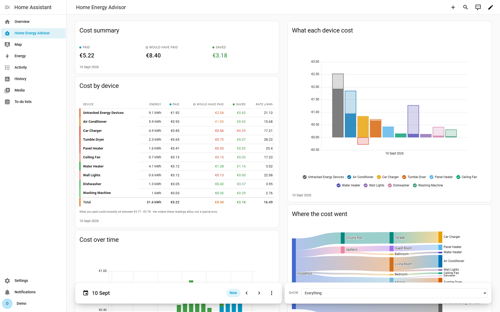
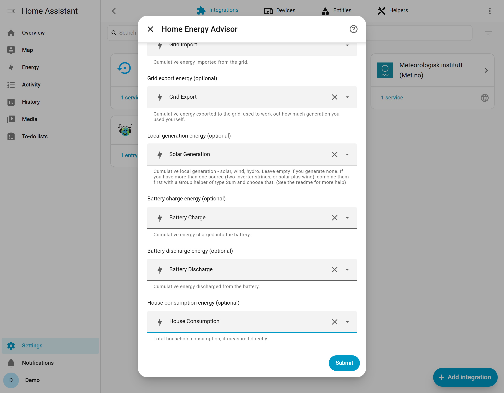
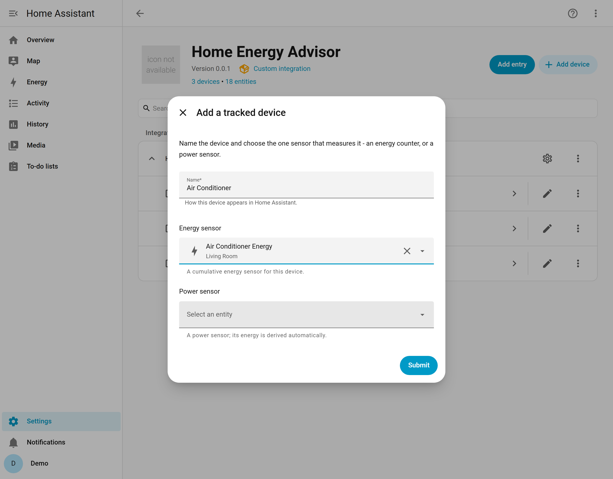
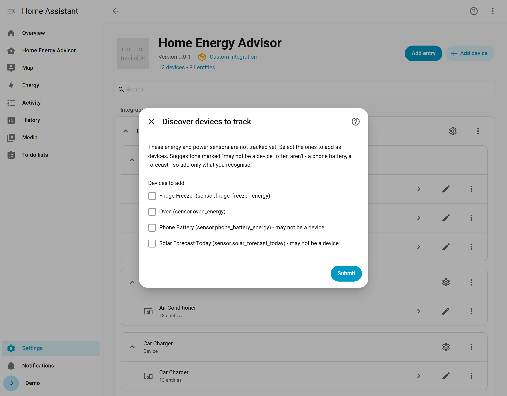
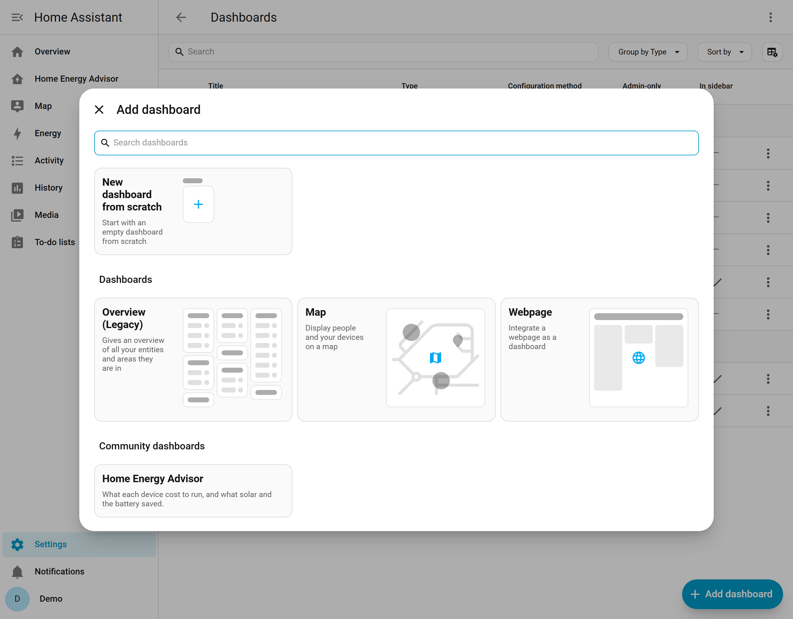
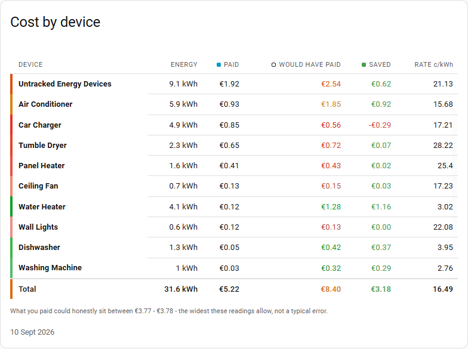
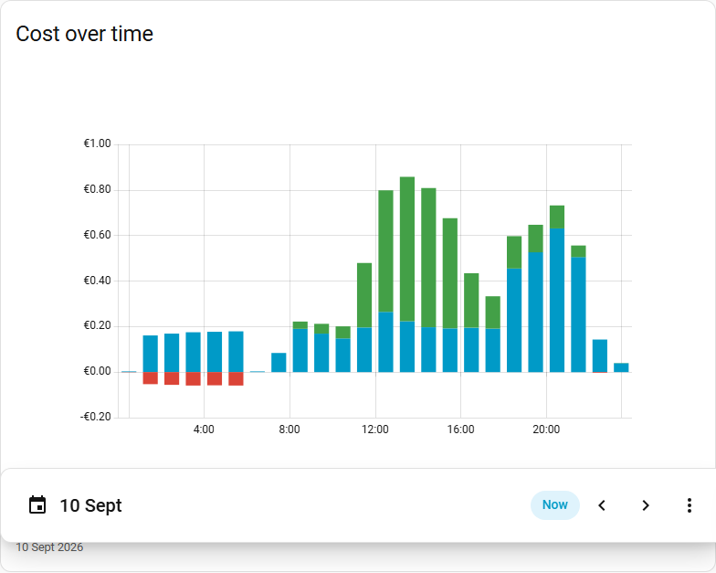
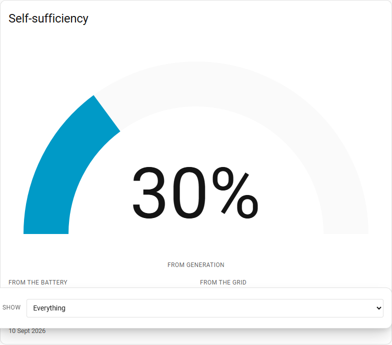
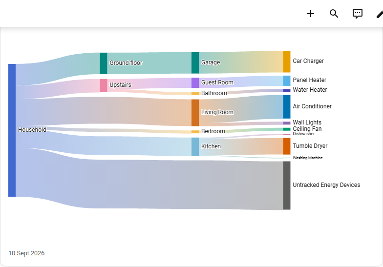
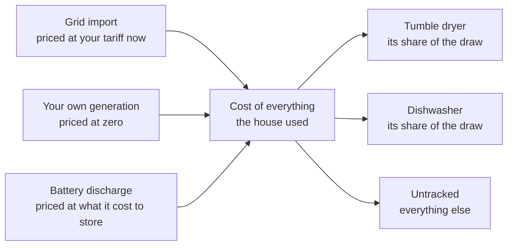

# Home Energy Advisor

A Home Assistant integration that tells you what each device in your home cost
to run, what it would have cost on grid electricity alone, and how much your own
generation (for example: solar, wind or hydro) and battery saved you.

Home Assistant already shows you where your energy went. This shows you where
your money went.



## Why you might want it

You can see on the Energy Dashboard that your house used 34 kWh yesterday. What
you cannot see is that 9 kWh of it was the tumble dryer, that it ran at seven in
the evening when your tariff was at its most expensive, and that moving it to
the middle of the afternoon would have cost you almost nothing, because your own
generation was covering more than the house was drawing.

Home Energy Advisor answers questions like:

- What did the dishwasher cost me this month?
- Which of my devices costs the most to run?
- How much did my own generation actually save me, in money rather than kWh?
- Is the washing machine cheaper overnight on my tariff, or in the middle of the
  day when the panels are producing?

It is most useful if you are on a dynamic or time-of-use tariff, or you generate
some of your own electricity, or both. It still works on a flat rate with no
generation: you get a straightforward per-device cost breakdown, and the savings
figures sit at zero because there is nothing to save against.

## What you need

- Home Assistant 2026.7 or newer.
- **A grid connection**, with a sensor giving your current import price per kWh.
  Dynamic tariff integrations provide one. On a fixed rate, create a Number
  helper and type your rate into it.
- **A cumulative grid import energy sensor**, in kWh. If you have set up the
  Energy Dashboard you already have one.
- **An energy or power sensor for each device you want to track.** Smart plugs,
  clamp meters and many appliances provide one. You do not need to track
  everything, or even most things - whatever you do not track is grouped into a
  single "Untracked" figure so the totals still add up.

Local generation, a battery and a whole-house consumption meter are all
optional. Generation means anything of your own that produces a cumulative kWh
figure - solar, wind, hydro - and several sources can be added together.

Off-grid homes are not supported: see
[What it does not do](#what-it-does-not-do).

## Installing

### Through HACS

1. In Home Assistant, go to **HACS**.
2. Open the three-dot menu at the top right and choose **Custom repositories**.
3. Paste `https://github.com/consultingtedds/ha-home-energy-advisor` into the
   repository box, choose **Integration** as the type, and select **Add**.
4. Search for **Home Energy Advisor** in HACS, open it and select **Download**.
5. Restart Home Assistant.

### Without HACS

Download the source, copy the `custom_components/home_energy_advisor` folder
into your Home Assistant `config/custom_components` folder, and restart Home
Assistant. Upgrading means repeating the copy, which is the main reason to use
HACS instead.

There is nothing to install for the dashboard and cards. They are part of the
integration and Home Assistant serves them from it. No frontend repository, no
Lovelace resource, and nothing copied into `www`.

## Setting it up

Go to **Settings** > **Devices & services** > **Add integration** and search for
**Home Energy Advisor**.

### The house



The first screen asks about your house as a whole. **Only two of these are
required: the import price and the grid import meter.** Every other field is
optional, and the accounting adapts to what you give it. If you have set up the
Energy Dashboard, most of them are filled in for you already.

| Input | Required | What to choose |
| --- | --- | --- |
| Import price | Yes | The sensor holding your current price per kWh |
| Currency | Yes | The currency your cost sensors report in, such as GBP or EUR |
| Grid import energy | Yes | Your cumulative import meter, in kWh |
| Grid export energy | No | Your cumulative export meter |
| Local generation energy | No | Cumulative generation of your own, whatever the source |
| Battery charge energy | No | Cumulative energy charged into a home battery |
| Battery discharge energy | No | Cumulative energy discharged from it |
| House consumption energy | No | Total household consumption, if you measure it directly |

Every energy input has to be a cumulative counter that only rises, which is what
Home Assistant calls a `total_increasing` sensor. The setup screen rejects
anything else rather than quietly misreading it: costs are shared out in
proportion, so one wrong house-level input makes every device's figure wrong.

#### When generation and export actually matter

This is the part worth reading twice, because it decides whether two of those
fields do anything at all for you.

To work out what a unit of electricity cost, Home Energy Advisor has to know how
much of your own generation the house used rather than exported. There are two
ways to get there, and which one applies to you depends on a single input:

- **If you have a house consumption sensor**, generation used at home is
  whatever your house consumed minus what came from the grid and the battery.
  That is a subtraction, and it needs no generation or export figure at all. You
  can fill both fields in and nothing will change: with a house consumption
  sensor configured, a generation meter that goes offline entirely does not move
  a single figure.
- **If you do not have one**, generation and export are the only route: what the
  house used of your own energy is what you generated, less what went into the
  battery, less what went out to the grid. Leave them empty and a generating
  house is accounted as though everything came off the meter, so costs read too
  high and savings read as zero.

If you generate nothing of your own, leave both empty and forget about them.
Nothing is lost.

#### If you have more than one generation source

The generation field takes one sensor, and plenty of houses have more than one
source - two inverter strings, or solar plus wind. Add them together first with
a helper Home Assistant already has:

1. **Settings** > **Devices & services** > **Helpers** > **Create helper**.
2. Choose **Group**, then **Sensor group**.
3. Pick your generation sensors, and set the type to **Sum**.
4. Choose that new sensor as your local generation energy.

### Your devices



Once the house is set up, add the devices you want costed. On the Home Energy
Advisor card in **Settings** > **Devices & services**, select **Add device**,
give it a name, and pick the one sensor that measures it.

That sensor can be either:

- **an energy sensor**, a cumulative kWh counter, or
- **a power sensor** reading in watts, in which case Home Assistant's own
  Integral helper is created for you to turn it into energy. You do not have to
  set that up or maintain it.

There is also a **Discover devices to track** option in the integration's
settings menu, which lists the energy and power sensors in your system that are
not tracked yet, so you can add several at once. It marks the ones that look
like they are not really devices - a phone battery, a generation forecast -
because plenty of sensors carry an energy or power unit without being an
appliance.



### Labelling your devices

The dashboard can narrow itself to a room, a floor, a label or a single device.

Rooms and floors need nothing from you. Home Energy Advisor reads the area of
the sensor you chose for each device, so if the air conditioner is in the
Bedroom in Home Assistant, its costs are in the Bedroom here too.

**Labels are the one thing you have to do yourself.** Home Assistant has no idea
that four of your devices are air conditioners and two are heaters, and guessing
from names cannot work in an integration that speaks more than one language. So
if you want to ask what the air conditioning cost this week as a group, put a
label on those devices:

1. **Settings** > **Devices & services** > **Devices**.
2. Select the devices you want to group, and add a label - `Air conditioning`,
   `Heating`, whatever you would ask a question about.

Label the **source devices** - the air conditioners themselves, the ones that
were already in Home Assistant. Home Energy Advisor's own devices are
deliberately left unlabelled and unassigned so that they mirror yours rather
than competing with them.

Until you have labelled something, the label filter has nothing to offer and
sits empty. That is a house with no labels, not a broken filter.

### Settings you can change later

The integration's settings menu also carries:

- **Cycle totals** - daily and monthly totals are always created. Weekly,
  quarterly and yearly are there if you want them.
- **Per-device cost range** - publishes a lowest and highest possible cost for
  each device, not just for the house. See
  [What the figures cannot know](#what-the-figures-cannot-know).
- **Reset all totals to zero** - starts every figure again and clears the
  history behind them. There is also a `home_energy_advisor.reset_totals`
  service for the same thing. It cannot be undone.

## The dashboard



Go to **Settings** > **Dashboards** > **Add dashboard**, and choose **Home
Energy Advisor** under *Community dashboards*. The title, icon and url are
filled in. Select **Create**.

That gives you every card, laid out, over your own devices. It is built each
time the page loads rather than saved, so a device you add next month appears on
its own and an upgrade brings the current layout with it.

**It is not locked.** If you want to change it, Home Assistant's own **Take
control** (three-dot menu > **Edit dashboard** > three-dot menu > **Take
control**) converts it into ordinary cards that are then yours to rearrange,
delete or mix with anything else.

Two other ways in, if a dashboard of its own is not what you want:

- **A Home Energy Advisor page inside a dashboard you already have.** Add a
  view, open **Edit in YAML** on it, and replace its contents with:

  ```yaml
  strategy:
    type: custom:hea
  ```

  This is the one route that needs YAML, only because Home Assistant has no
  picker for view strategies yet.

- **Individual cards.** They are all in the card picker under **Home Energy
  Advisor**, and can go in any view you like. A card with no options set shows
  every tracked device.

If your dashboards are YAML files rather than UI-managed, none of the above
applies, and [`docs/dashboard-template.yaml`](docs/dashboard-template.yaml) is a
complete working page to copy.

### What the cards tell you

The dashboard is one card per question. These are the ones that answer the
questions at the top of this page; [`docs/dashboard.md`](docs/dashboard.md) has
the rest, and every option each of them takes.

**What each device cost, and what it would have cost.**



Every device, sorted by what it cost. *Would have paid* is the same energy
bought off the meter at the price it was drawn, so the difference is what your
own generation and battery were worth. The coloured edge tells you at a glance
which devices are doing well: the water heater here runs on a timer at midday
and pays about a tenth of grid price, while the tumble dryer runs in the evening
and saves almost nothing.

A device can also cost **more** than the grid would have, and the table says so
rather than hiding it. The car charger above is drawing stored energy that was
put into the battery when electricity was dearer than it is overnight.

**When the money went.**



The same period, hour by hour. This is the card that answers whether the washing
machine is cheaper overnight or in the middle of the afternoon, because you can
see the answer rather than work it out.

**How much your own generation actually saved you.**



What share of the house ran on your own electricity rather than the grid's, in
energy and in money.

**Where the cost went.**



The same total, broken down by floor, then room, then device. Rooms and floors
come from Home Assistant's own areas, so this needs nothing from you beyond
having put your source sensors in rooms.

## The sensors you get

Each tracked device gets its own device in Home Assistant, carrying these:

| Sensor | Unit | What it is |
| --- | --- | --- |
| Energy Used | kWh | The energy the device used |
| Actual Cost | your currency | What it cost, given the mix of grid, generation and battery that served it |
| Cost at Grid Price | your currency | What the same energy would have cost bought from the grid at the price at the time |
| Cost Savings | your currency | Cost at Grid Price minus Actual Cost |
| Energy From Grid | kWh | How much of Energy Used came off the meter |
| Energy From Generation | kWh | How much came from your own generation |
| Energy From Battery | kWh | How much came from the battery |

Three more devices are created alongside them:

- **Untracked Energy Devices** carries the same set for everything the house used
  that no tracked device claimed. It is what makes the parts add up to the whole.
- **Whole Home** carries the same set for the house, plus **Lowest Possible
  Cost** and **Highest Possible Cost**.
- **Home Energy Advisor** carries **Unreconciled Energy**, which should read
  zero, and a diagnostic list of tracked devices that the cards read.

Energy Used, Actual Cost and Cost at Grid Price also come as daily and monthly
totals, named after the sensor and the period - `Tumble Dryer Actual Cost Daily`
and so on. These are native Home Assistant `utility_meter` helpers, created for
you. Savings for a period is the difference between the two cost totals.

Sensor names, and so entity ids, follow your Home Assistant language. On a
Spanish instance the sensors are named in Spanish.

## How the accounting works

Time is cut into five minute intervals. In each one, everything the house
consumed came from somewhere, and each of those sources has a price:

**How one interval is priced and shared out**



Each source is shared out across the devices drawing at the time, in proportion
to how much each one drew. A device running while your own generation covers the
house is charged mostly at zero; the same device at seven in the evening is
charged at your evening rate. Battery energy is priced at what it cost to put in
there, not at today's rate, so a battery charged cheaply overnight and used at
peak shows up as the saving it is.

The rule the whole model is built around: **the costs of every device plus
Untracked add up to what the energy really cost.** Not approximately. If your
figures do not add up to your meter, that is a bug, and there is an
Unreconciled Energy sensor whose job is to tell you.

[ADR-0002](docs/adr/0002-cost-attribution-proportional-source-allocation.md) is
the full reasoning, including the simpler model that was tried first and why it
was wrong.

### What Actual Cost does not include

Actual Cost is the price of metered energy at the time it was used. It is not
your bill. It leaves out:

- **Standing charges.** The daily fee you pay whether you use anything or not.
- **Payback for exported energy.** Money coming back to you, not a cost of
  running a device.
- **The export revenue you gave up** by using your own generation instead of
  selling it.

All three are correct to leave out, because none of them belongs to any
particular device. But it does mean your total will be short of your bill, and
that the savings figures are on the optimistic side: generation is priced at
zero, when in truth it could have been sold.

### What the figures cannot know

- **A device that reports its energy once an hour used it somewhere inside that
  hour, and nothing in the data says where.** Priced at the cheapest five
  minutes of that hour it is one number, at the dearest another. The Lowest and
  Highest Possible Cost sensors publish that range for your house, and for each
  device if you turn the option on. It is the widest the readings allow rather
  than a typical error.
- **Cost Savings can go negative, and that is real.** Energy stored when
  electricity was expensive and used when it was cheap cost more than buying it
  at the time would have. It is shown as a loss rather than hidden at zero.
- **Today's cost catches up rather than going backwards.** Energy a device
  reports before the house meter has accounted for it is held back until its
  real price is known. A figure read mid-hour can sit a little low and rise
  later. It never falls.

## What it does not do

- **It needs a grid connection.** An import price and a grid import meter are
  both required, and the comparison the whole product is built on - what you
  paid, against what the grid would have charged for the same energy - has no
  meaning without a grid tariff to compare to. **Off-grid homes are not
  supported.**
- **It treats your own generation as free at the moment you use it.** That is
  right where the next unit costs nothing to make, which covers solar, wind and
  hydro. It is wrong for anything that burns fuel: energy from a diesel
  generator or a CHP unit is counted as free, so any device running on it looks
  cheaper than it really was. A battery is different, and is handled properly -
  it is priced at what the energy cost to store.
- **It is not a bill,** for the reasons above.
- **It does not go back in time.** Figures start from the moment you install it.
  There is no import of your existing history.
- **It does not forecast, optimise, schedule or automate anything.** It explains
  what happened. Deciding what to do about it is yours.
- **It does not replace the Energy Dashboard.** It sits alongside it, and reads
  the same sensors.
- **It covers electricity.** Not gas, not water.
- **One household per Home Assistant instance.**

## Known issues

**Statistics unit warnings on a fresh install.** The first time each device
accrues a cost, Home Assistant may raise a warning like:

```
The unit of 'Tumble Dryer Cost at Grid Price Daily' changed to 'EUR' which
can't be converted to the previously stored unit, ''.
```

On a house with a lot of devices there can be one per cost total, which is
alarming and harmless. Home Assistant's `utility_meter` only picks up the unit
of its source when that source first changes, so a total created over a sensor
sitting at zero is recorded without a unit until the device first uses
something.

The rows involved contain nothing but zeros, so Home Assistant's own repair is
safe to accept: open the notification and choose either to update the units of
the old values or to delete them and start over. Either one clears it for good.
Resetting all totals puts every total back into that state, so it can happen
again after a reset.

A fix belongs in Home Assistant itself rather than here, and is being pursued
upstream.

## Something looks wrong

Report it on [GitHub Issues](https://github.com/consultingtedds/ha-home-energy-advisor/issues).

For anything to do with a figure being wrong, attach the diagnostics download:
**Settings** > **Devices & services** > **Home Energy Advisor**, then the
three-dot menu and **Download diagnostics**. It carries the reasoning behind
every reading - why each one was counted, held or refused - which is usually
enough to explain a number without needing access to your system. Entity ids and
device names are redacted.

## Contributing

Contributions are welcome. [CONTRIBUTING.md](CONTRIBUTING.md) covers the
development setup, the house style and the things that are easy to trip over.

The test suite needs a Unix-like operating system - Linux, macOS, or WSL on
Windows - because Home Assistant imports `fcntl`. Python 3.14.2 or newer.

```bash
pip install -r requirements_test.txt
pytest
```

The accounting engine under `custom_components/home_energy_advisor/engine/` is
plain Python with no Home Assistant imports at all, so the model can be tested
on its own. That is deliberate, and it is where the interesting tests live.

If you want to understand why the code is shaped as it is, read
[`docs/adr/`](docs/adr/). Every significant decision is recorded there, along
with the alternatives that were rejected and the reasons.

## Licence

[MIT](LICENSE)
